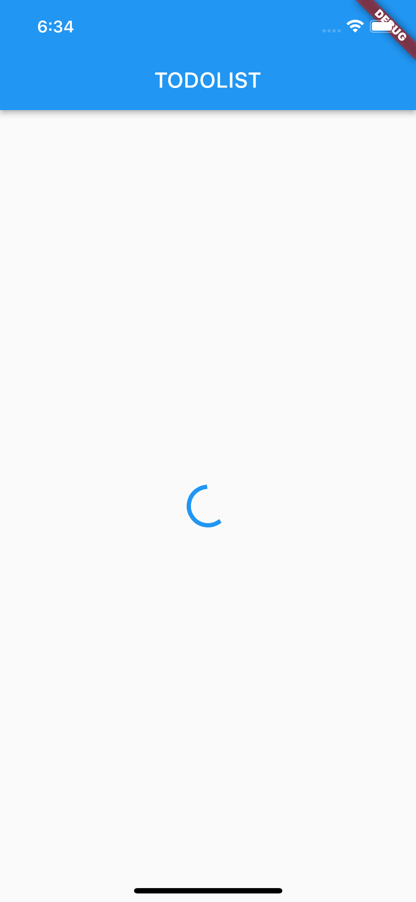

# HACKNITRR-Koi-na.cpp
**Submission** for HackNITRR'22 by team **"Koi na.cpp"**.

# Problem: 
Data breaching from Notes/Todolist apps in smartphone by spammers.

# Solution:
Using etherium blockchain ,smartcontracts to secure it and combining it with flutter to build a notes/TodoList app.

&nbsp;

&nbsp;

# Tech_Tools_Used:

- Ganache.
- Truffle.
- Etherium blockchain.
- Flutter.
- Material UI.

&nbsp;

&nbsp;

# Tech Used:

- Blockchain
- Flutter

&nbsp;

&nbsp;

&nbsp;

## Team - Koi na.cpp

- *Raj Motwani* (1st Sem)- Blockchain & App building
- *Somya Kabra* (1st Sem)- Designing part(logo &UI)

&nbsp;

&nbsp;

&nbsp;

## Screenshots

&nbsp;

    
  </a>

